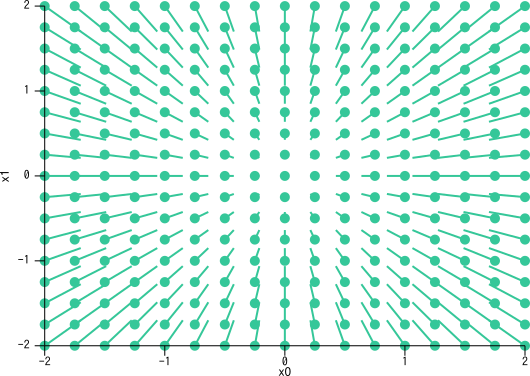

木瓜丸です。

最近、自作PCにRadeon RX550というグラボを積んでみました。
2画面という男の夢を叶えるために買ったのですが、せっかくなので機械学習とか仮想通貨掘るとか面白いことがしたいなーと思ったので、ちょっとブログのネタがてらやってみようと思います。

…と思ったのですが、私が買ったのはRadeonですんで、一般的に機械学習ツヨツヨマンが使っているCUDAとやらが必要な技術はちょいと面倒みたいです。

だが思い立った限りはこの程度ではやめませんぞ。今回はしっかりと**numpyで**、微分から実装して、ゆくゆくは**ROCm**を書こうと思います。

## 微分

では、さっそくpythonで微分を書くところから始めましょう。
とりあえずこれはみんなが読んでるブログですので、さらっと微分の定義を申し訳程度に書いておきます。

$$
f'(x) = \frac{f(x+h) - f(x)}{h}
$$

ところで、僕は昔から疑問に思っておりました。**「コンピューターで微分って無理くないか？」**

どうやら、世間の微分を要するプログラムでは32ビットの浮動小数点数を用いて、$$h = 0.0001$$をすれば微分していることになるらしいです。というわけで、コードはこんなふうになります。

ちなみに、微分は英語で*differentiation*だそうです。

```rust
const H: f32 = 0.0001;

fn diff<F>(f: F, x: f32) -> f32
    where F: Fn(f32) -> f32 {
    let a = x + H/2.0;
    let b = x + H/2.0;
    f(a) - f(b) / H
}
```

ポイントなんですが、微分の定義そのままではなく、微分したい点の前後をとって平均変化率を求めています。
やっぱりコンピューターでやってる限りhがでかくなってしまうので、$$x$$から$$x+h$$の範囲で変化率を求めてしまうとズレてしまいますので、xを中心に計算するみたいです。

## 勾配

さて、微分ができたら、次は**勾配**とやらを実装してみましょう。

勾配という言葉について、僕もよくわからなかったので、ゴーグルで調べてきました。

> ベクトル解析におけるスカラー場の勾配は、各点においてそのスカラー場の変化率が最大となる方向への変化率の値を大きさにもつベクトルを対応させるベクトル場である。
> 引用: Wikipedia - [勾配 (ベクトル解析)](https://ja.wikipedia.org/wiki/%E5%8B%BE%E9%85%8D_(%E3%83%99%E3%82%AF%E3%83%88%E3%83%AB%E8%A7%A3%E6%9E%90))

具体的に次のような関数を考えてみます。

$$
f(x_0, x_1) = x_0^2 + x_1^2
$$

これを、$$x_0$$だけについて、あるいは$$x_1$$だけについて微分してみます。これを偏微分といいます。

$$
\frac{\delta f}{\delta x_0} = 2x_0 \\
\frac{\delta f}{\delta x_1} = 2x_1
$$

この作業を、ある点について行ったときに得られるベクトル$$(\frac{\delta f}{\delta x_0}, \frac{\delta f}{\delta x_1})$$が勾配です。

では、勾配を求める関数を作ってみましょう。
ちなみに、勾配は英語で*gradient*だそうです。

```rust
const H: f32 = 0.0001;

fn grad<F>(f: F, x: Vec<f32>) -> Vec<f32>
    where F: Fn(Vec<f32>) -> f32 {    
    let mut g = Vec::new();
    for i in 0..x.len() {
        let mut x_a = x.clone();
        x_a[i] = x_a[i] + H / 2.0;
        let ya = f(x_a);
        let mut x_b = x.clone();
        x_b[i] = x_b[i] - H / 2.0;
        let yb = f(x_b);
        g.push((ya - yb) / H);
    }
    g 
}
```

今考えた関数$$f(x_0, x_1)$$はちょうど2変数関数なので、勾配のベクトルを二次元のグラフにマップしてみてみましょう。

```rust
extern crate plotlib;

use plotlib::page::Page;
use plotlib::repr::Plot;
use plotlib::style::{PointMarker, PointStyle, LineStyle};
use plotlib::view::ContinuousView;

const H: f32 = 0.0001;

fn grad<F>(f: F, x: Vec<f32>) -> Vec<f32>
    where F: Fn(Vec<f32>) -> f32 {    
    let mut g = Vec::new();
    for i in 0..x.len() {
        let mut x_a = x.clone();
        x_a[i] = x_a[i] + H / 2.0;
        let ya = f(x_a);
        let mut x_b = x.clone();
        x_b[i] = x_b[i] - H / 2.0;
        let yb = f(x_b);
        g.push((ya - yb) / H);
    }
    g 
}

fn main() {
    let subsq = |x: Vec<f32>| x[0] * x[0] + x[1] * x[1];
    let mut g = Vec::new();
    for i in -8..=8 {
        for j in -8..=8 {
            let i_ = (i as f32) / 4.0;
            let j_ = (j as f32) / 4.0;
            let g_ = grad(subsq, vec![i_, j_]);
            let i__ = i_ as f64;
            let j__ = j_ as f64;
            g.push(vec![(i__, j__), ((g_[0] * -0.075) as f64 + i__, (g_[1] * -0.075) as f64 + j__)]);
        }
    }
    let mut v = ContinuousView::new();
    for g_ in g {
        let s1: Plot = Plot::new(g_.clone()).line_style(
            LineStyle::new().colour("#35c799")
        );
        let s2: Plot = Plot::new(vec![g_.clone()[0]]).point_style(
            PointStyle::new().colour("#35c799")
        );
        v = v.add(s1).add(s2);
    }
    let v = v.x_range(-2.0, 2.0)
        .y_range(-2.0, 2.0)
        .x_label("x0")
        .y_label("x1");
    Page::single(&v).save("graph.svg").unwrap();
}
```



なんか旭日みたいなのが出てきました。これを見ると、中心から放射型にベクトルの大きさが大きくなっていることがわかります。

これをうまいこと利用すると、勾配を正しいベクトルとの誤差として認識して勾配が最小になるように頑張る「**勾配降下法**」という学習ができるみたいです。

次の記事で勾配降下法を実装してみようと思います。

一緒に勉強しましょうー(^o^)

### 参考文献


